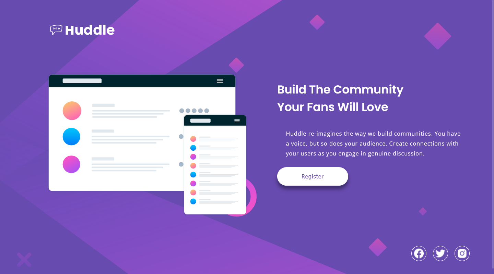

# Frontend Mentor - Huddle landing page with single introductory section


## Deploying your project

As mentioned above, there are many ways to host your project for free. Our recommended hosts are:

- [GitHub Pages](https://pages.github.com/)
- [Vercel](https://vercel.com/)
- [Netlify](https://www.netlify.com/)

## Submitting your solution

Submit your solution on the platform for the rest of the community to see. Follow our ["Complete guide to submitting solutions"](https://medium.com/frontend-mentor/a-complete-guide-to-submitting-solutions-on-frontend-mentor-ac6384162248) for tips on how to do this.

## Got feedback for us?

We love receiving feedback! We're always looking to improve our challenges and our platform. So if you have anything you'd like to mention, please email hi[at]frontendmentor[dot]io.

# Frontend Mentor - Huddle landing page with single introductory section solution

This is a solution to the [Huddle landing page with single introductory section challenge on Frontend Mentor](https://www.frontendmentor.io/challenges/huddle-landing-page-with-a-single-introductory-section-B_2Wvxgi0). Frontend Mentor challenges help you improve your coding skills by building realistic projects. 

## Table of contents

- [Overview](#overview)
  - [The challenge](#the-challenge)
  - [Screenshot](#screenshot)
  - [Links](#links)
- [My process](#my-process)
  - [Built with](#built-with)
  - [What I learned](#what-i-learned)
  - [Continued development](#continued-development)
- [Author](#author)


## Overview
- Reto interesante, ya que, en este caso te dan la imagen para móvil de 750px y debes trasladarlo al diseño para 375px. Como no estoy acostumbrado, me ha costado algo más.

- En este caso me he decantado por aplicar la solución desde flexbox. Pasando de dos contenedores en una columna a dos columnas(a partir de los 1200px) un contenedor a cada columna.

### The challenge

- La solución que he presentado, tiene deficiencias por que los iconos que me bajé eran de color negro y no podía modificar el color. Ahora sé, que si hubiera descargado iconos svg, podría cambiar su color.

- Por otra parte no supe colocar adecuadamente la imagen de fondo en el diseño escritorio, en eso debo mejorar.

- Por lo demás está bien. He de mejorar en la previsión de estilos, cuando cambio de un diseño a otro. Por que sino tengo que ir hacía atras, remodificando estilos y en casos extremos, hasta el HTML.

### Screenshot



### Links

- Solution URL: [solución landig-page](https://github.com/juan-mentor/huddle-landing-page-with-single-introductory-section-master.git)
- Live Site URL: [sitio en vivo](https://juan-mentor.github.io/huddle-landing-page-with-single-introductory-section-master/)

## My process

- En este caso, como era la primera vez que me encontraba en esta situación. He empezado ha hacer la estructura HTML para el diseño de 750px, una vez he terminado, empecé con los estilos de 750px y luego los adapté para el diseño de 375px. Una vez lo tenía claro (me costó un poco más de lo normal). Me dediqué a los estilos del diseño de 1440px.

- Encontré varios obstáculos, debido sobre todo a la descarga de iconos o recursos externos, también sobre la sobreescritura de las imágenes de fondo (creía que una sobreescribía a la otra). Para bien
he aprendido, que debo pensar en las pequeñas transformaciones a nivel global o me pasaré más tiempo 
volviendo hacía atrás y reescribiendo los estilos. Tengo que encontrar una forma de organizar mejor mis estilos, ya que pierdo tiempo buscando propiedades para corregirlas, o , para cuando estoy en la consulta de medios modificar algún comportamiento y no duplicar líneas de estilo.

### Built with

- Semantic HTML5 markup
- CSS custom properties
- Flexbox
- Mobile-first workflow

### What I learned
     
- He aprendido que las imágenes de fondo no se anulan cuando llamas a la ruta de escritorio y la de móvil.      

```css
    body {
        background-image: url("ruta de la imagen móvil");
    }

    @ media sreen and (min-width: 75rem) {
        body {
            background-image: url("ruta de la imagen escritorio");
            /* Se dibujan ambas imágenes */
        }
    }
```

### Continued development

- Sobre como posicionar bien las imágenes de fondo.

## Author

- Frontend Mentor - [@juan-mentor](https://www.frontendmentor.io/profile/juan-mentor)